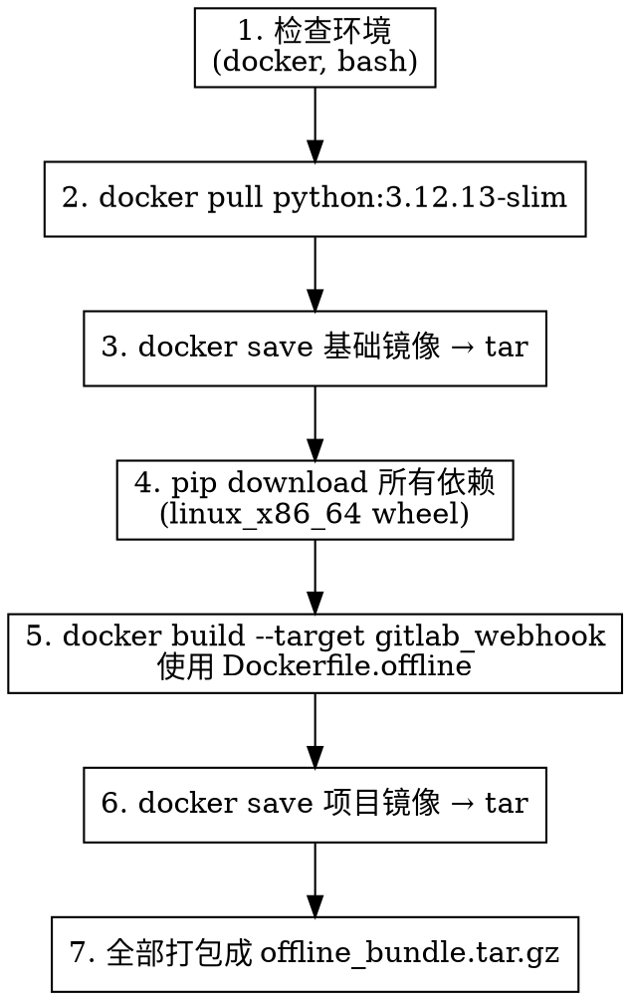
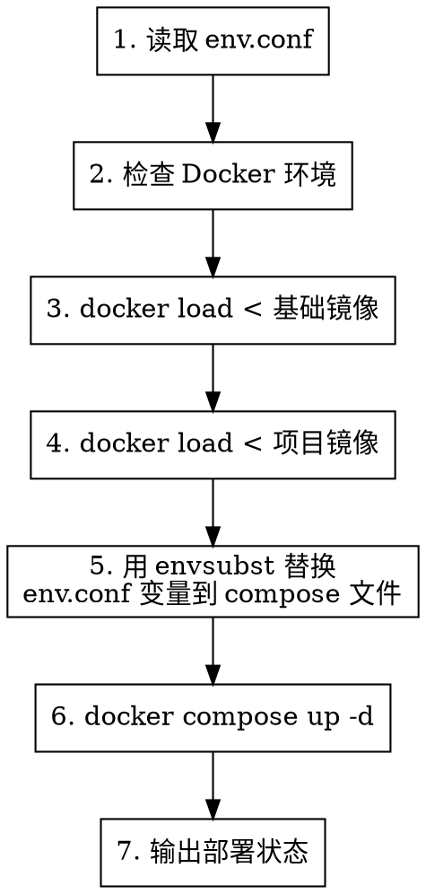

# 离线 Docker 部署方案设计文档

**日期**: 2026-07-28  
**主题**: PR-Agent GitLab Webhook 离线 Docker 部署  
**状态**: 已确认

---

## 1. 目标

为 PR-Agent 项目提供一套完整的离线 Docker 部署方案，适用于在有网络限制的 Debian Linux 环境下运行 GitLab Webhook 服务。

### 关键约束

- 目标生产环境：Debian 13.6 (x86_64)，Docker 29.6.2，完全无外网
- 构建环境：Debian 12 (x86_64)，有网络，安装 Docker 后执行打包
- 运行模式：GitLab Webhook
- AI 模型：自部署的 newapi 网关（OpenAI 兼容 API）

---

## 2. 目录结构

```
pr-agent/
└── deploy/
    ├── env.conf                 # 环境配置宏文件（唯一配置入口）
    ├── prepare-offline.sh       # 步骤1：联网构建机执行，生成离线包
    ├── deploy.sh                # 步骤2：离线生产机一键部署
    ├── uninstall.sh             # 一键卸载清理（代码更新时使用）
    ├── Dockerfile.offline       # 离线专用 Dockerfile（精简 GitLab 场景）
    ├── docker-compose.yml       # Docker Compose 编排文件
    └── .gitignore               # 忽略 offline_bundle/ 等大文件
```

**不在仓库追踪的内容**（由 `prepare-offline.sh` 生成）：
- `deploy/offline_bundle/` — 离线镜像 tar + pip wheel 包
- `deploy/offline_bundle.tar.gz` — 打包后的离线传输文件

---

## 3. 组件设计

### 3.1 env.conf — 配置宏文件

唯一的配置入口文件，采用 `KEY=VALUE` 格式，支持注释。

```bash
# ========== 服务配置 ==========
SERVICE_PORT=3000
CONTAINER_NAME=pr-agent-gitlab

# ========== AI 模型配置 ==========
OPENAI_API_KEY=sk-xxx
OPENAI_API_BASE=http://your-newapi-server/v1
MODEL_NAME=gpt-5.5

# ========== GitLab 配置 ==========
GITLAB_URL=https://gitlab.your-company.com
GITLAB_PAT=glpat-xxx
GITLAB_SHARED_SECRET=change-me-to-a-random-string

# ========== PR-Agent 行为配置 ==========
PR_COMMANDS="/describe,%20/review"
PUSH_COMMANDS="/describe,%20/review"

# ========== 运行时配置 ==========
LOG_LEVEL=DEBUG
VERBOSITY_LEVEL=0
```

**设计决策**：
- 用户只修改这一个文件，脚本自动读取变量注入到 docker-compose 和 .secrets.toml 中
- 字段注释自带示例，降低使用门槛
- 通过 `source env.conf` 加载，变量命名直观

### 3.2 prepare-offline.sh — 离线包构建

**执行环境**：联网的 Linux（Debian 12 构建机，需安装 Docker）

**执行流程**：



**关键点**：
- 必须在 Linux x86_64 上执行，pip download 才会下载正确的 `manylinux_x86_64` wheel
- 离线包大小预估：基础镜像 ~150MB + 依赖 ~200MB + 项目镜像 ~50MB ≈ **400MB**
- 脚本幂等：重复执行会清理旧的 `offline_bundle/` 目录

### 3.3 Dockerfile.offline — 离线构建镜像

与现有 `docker/Dockerfile` 的区别：
- 只保留 `gitlab_webhook` target，精简不需要的服务（github_app、bitbucket、mosaico 等）
- `pip install` 阶段从本地 wheel 目录安装而非 pypi.org
- 多阶段构建：基础层安装系统依赖，运行时层安装 pip 包和项目代码

```dockerfile
FROM python:3.12.13-slim AS base
RUN apt update && apt install --no-install-recommends -y git curl && \
    apt-get clean && rm -rf /var/lib/apt/lists/*

FROM base AS gitlab_webhook
WORKDIR /app

# 离线安装 pip 依赖（wheel 包由 prepare-offline.sh 提前下载）
COPY offline_wheels/ /tmp/wheels/
RUN pip install --no-cache-dir --no-index --find-links=/tmp/wheels/ /tmp/wheels/*.whl && \
    rm -rf /tmp/wheels/

# 安装项目本身
COPY . /app/
RUN pip install --no-cache-dir --no-deps -e .

ENV PYTHONPATH=/app
CMD ["python", "-m", "gunicorn", "-k", "uvicorn.workers.UvicornWorker", \
     "-c", "pr_agent/servers/gunicorn_config.py", \
     "--forwarded-allow-ips", "*", \
     "pr_agent.servers.gitlab_webhook:app"]
```

### 3.4 docker-compose.yml — 服务编排

```yaml
version: "3.8"
services:
  pr-agent-gitlab:
    image: pr-agent-gitlab:offline
    container_name: ${CONTAINER_NAME}
    ports:
      - "${SERVICE_PORT}:3000"
    environment:
      - OPENAI_KEY=${OPENAI_API_KEY}
      - OPENAI_API_BASE=${OPENAI_API_BASE}
      - CONFIG_MODEL=${MODEL_NAME}
      - GITLAB_URL=${GITLAB_URL}
      - GITLAB_PERSONAL_ACCESS_TOKEN=${GITLAB_PAT}
      - GITLAB_SHARED_SECRET=${GITLAB_SHARED_SECRET}
      - GIT_PROVIDER=gitlab
      - CONFIG_LOG_LEVEL=${LOG_LEVEL}
      - CONFIG_VERBOSITY_LEVEL=${VERBOSITY_LEVEL}
    restart: unless-stopped
    healthcheck:
      test: ["CMD", "curl", "-f", "http://localhost:3000/health"]
      interval: 30s
      timeout: 10s
      retries: 3
```

**设计决策**：
- 端口映射 `${SERVICE_PORT}:3000` — 容器内固定 3000，外部通过 env.conf 自定义
- 所有敏感配置通过环境变量注入，不在 compose 文件中硬编码
- `restart: unless-stopped` 保证服务器重启后自动恢复

### 3.5 deploy.sh — 一键部署

**执行环境**：离线 Debian 13.6 生产机（已安装 Docker）

**执行流程**：



**关键点**：
- `envsubst` 将 env.conf 中的 `${VAR}` 替换进 docker-compose.yml
- 部署前检查 Docker daemon 是否运行、端口是否冲突
- 幂等：重复执行先 stop 旧容器再重新创建

### 3.6 uninstall.sh — 一键卸载

**执行流程**：

1. `docker compose down` — 停止并删除容器
2. 询问是否删除镜像：`docker rmi pr-agent-gitlab:offline python:3.12.13-slim`
3. 询问是否删除持久化数据（`.secrets.toml`、日志等）
4. 输出清理结果

**设计决策**：
- 分步确认，避免误删数据
- 单独提供 `uninstall.sh --force` 无条件全部清理（用于脚本化更新流程）

---

## 4. 代码更新流程

```bash
# 在构建机上
./prepare-offline.sh          # 重新打包
scp offline_bundle.tar.gz root@production:/tmp/

# 在生产机上
./uninstall.sh --force        # 卸载旧版本
tar xzf /tmp/offline_bundle.tar.gz -C /opt/pr-agent/
./deploy.sh                   # 部署新版本
```

---

## 5. 错误处理

| 场景 | 处理方式 |
|------|---------|
| Docker 未安装/未启动 | `deploy.sh` 检测后报错退出，提示安装命令 |
| 端口被占用 | `deploy.sh` 检测后报错，提示修改 `env.conf` 中的 `SERVICE_PORT` |
| 磁盘空间不足 | `deploy.sh` 检测可用空间 < 2GB 时报错 |
| env.conf 缺少必填项 | 脚本启动时校验，列出缺失字段 |
| docker load 镜像版本冲突 | `uninstall.sh` 已删除旧镜像，`deploy.sh` 重新 load 新镜像 |

---

## 6. 测试计划

- 在 Debian 12 构建机上执行 `prepare-offline.sh`，验证离线包生成成功
- 在目标 Debian 环境执行 `deploy.sh`，验证服务启动且健康检查通过
- 执行 `uninstall.sh`，验证容器/镜像清理干净
- GitLab webhook 端到端测试：触发 MR 事件，验证 PR-Agent 响应
